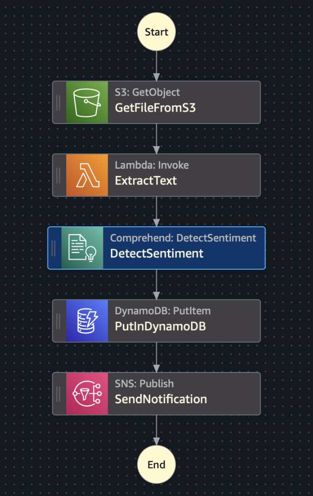
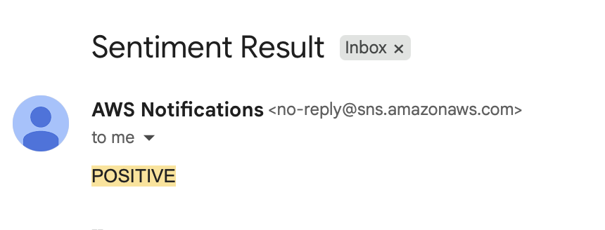

<h1 align="center">⚡ SentiFlow: Serverless NLP Pipeline Using S3, Lambda & Comprehend</h1>
<h3 align="center">Drop. Detect. Deliver Sentiment. From Upload to Insights in Seconds.</h3>

---

<h3> 🛠️ AWS Services Used -</h3>

- S3 - Input documents  
- EventBridge	- Trigger Step Function on upload  
- Lambda - Extract text from JSON  
- Comprehend - Analyze sentiment  
- DynamoDB - Store result and scores  
- SNS - Alert with final sentiment  
- Step Functions - Orchestrate entire workflow  

---

## 📌 Overview

This project automatically processes text documents uploaded to an S3 bucket. Upon upload, an AWS Step Function is triggered that:
1. Extracts the text from the uploaded JSON.
2. Analyzes sentiment using Amazon Comprehend.
3. Stores results in DynamoDB.
4. Sends an email notification using SNS.

✅ Fully event-driven  
✅ No EC2 or Textract  
✅ Low cost, scalable, and beginner-friendly 
 

  

## 🛠️ Step-by-Step Setup

> 1. S3 Bucket
- Create a bucket
- Enable EventBridge for the bucket 

> 2. Lambda Function – ExtractTextFromS3Json
- Runtime: Python 3.12
- Function: Fetch object from S3 and return text 

> 3. DynamoDB Table
- Create Table
- Partition Key: id (String) 

> 4. SNS Topic
- Create SNS topic
- Subscribe your email 

> 5. Step Functions State Machine
- Define each state:
- GetFileFromS3: Fetch object
- ExtractText: Lambda invoke
- DetectSentiment: Comprehend detect
- PutInDynamoDB: Store result
- SendNotification: Publish SNS
- Ensure "End": true in final state 

> 6. EventBridge Rule
- Triggers on S3 PutObject events
- Targets the Step Function
 

  
